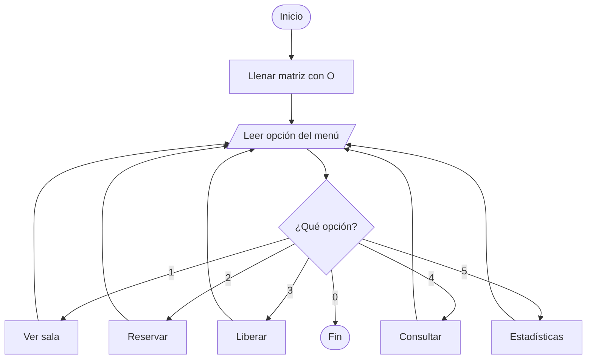
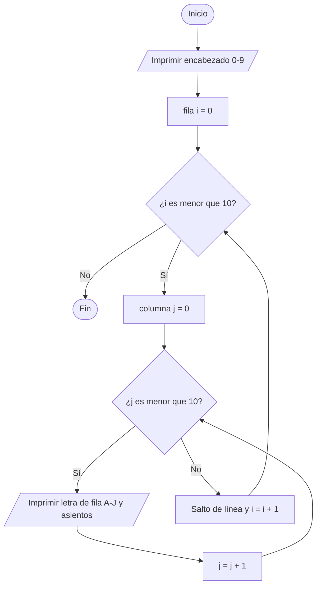
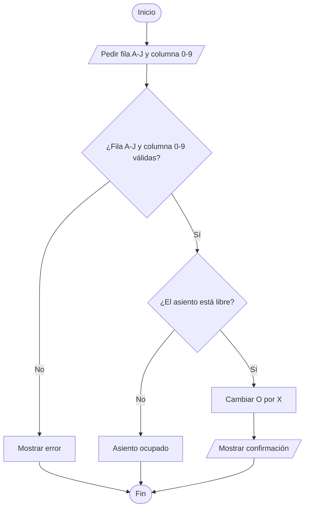
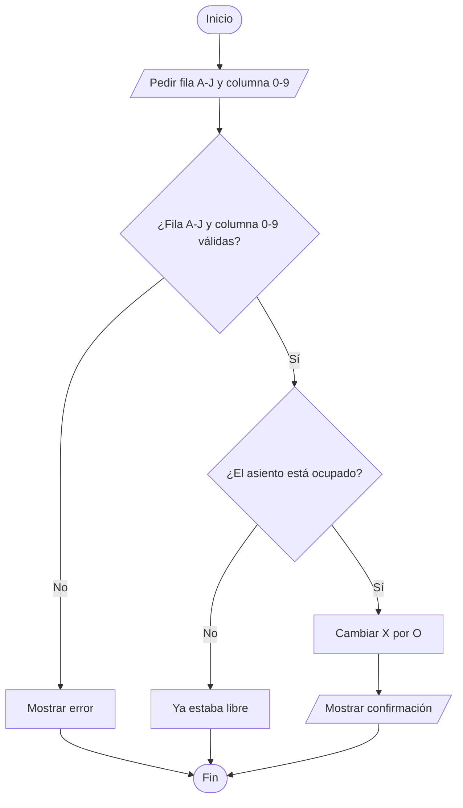
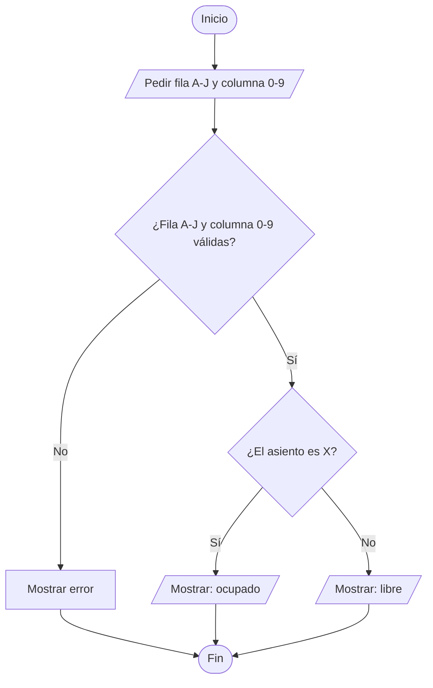
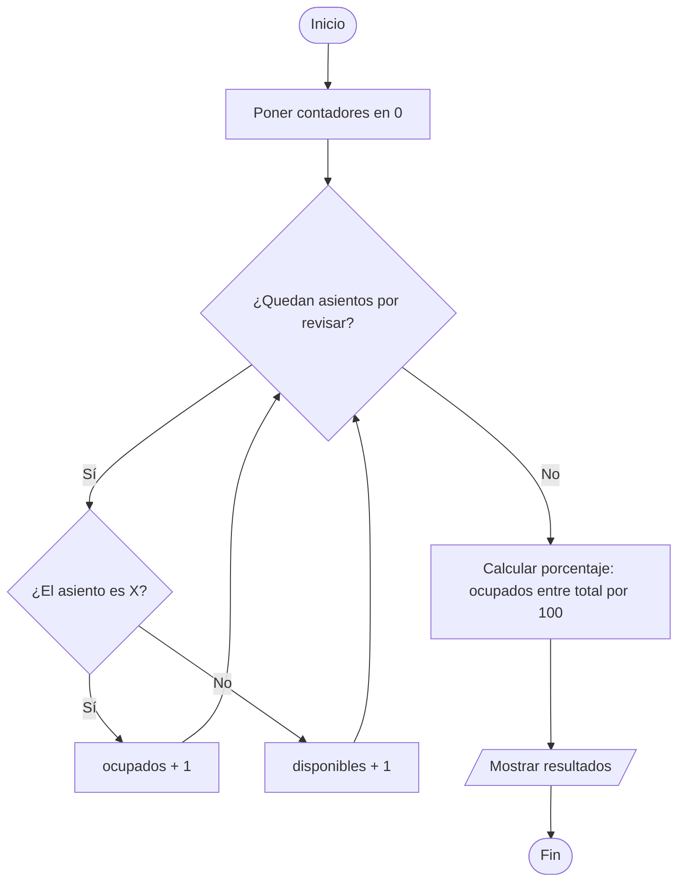

# Día 2: Diagramas de flujo

## 1. Menú principal

```mermaid
flowchart TD
    A([Inicio]) --> B[Llenar matriz con O]
    B --> C[/Leer opción del menú/]
    C --> D{"¿Qué opción?"}
    D -->|1| E[Ver sala]
    D -->|2| F[Reservar]
    D -->|3| G[Liberar]
    D -->|4| H[Consultar]
    D -->|5| I[Estadísticas]
    D -->|0| J([Fin])
    E --> C
    F --> C
    G --> C
    H --> C
    I --> C
```

## 2. Mostrar sala

```mermaid
flowchart TD
    A([Inicio]) --> B[/Imprimir encabezado 0-9/]
    B --> C[fila i = 0]
    C --> D{"¿i es menor que 10?"}
    D -->|No| Z([Fin])
    D -->|Sí| E[columna j = 0]
    E --> F{"¿j es menor que 10?"}
    F -->|Sí| G[/Imprimir letra de fila A-J y asientos/]
    G --> H[j = j + 1]
    H --> F
    F -->|No| I[Salto de línea y i = i + 1]
    I --> D
```

## 3. Reservar asiento

```mermaid
flowchart TD
    A([Inicio]) --> B[/Pedir fila A-J y columna 0-9/]
    B --> C{"¿Fila A-J y columna 0-9 válidas?"}
    C -->|No| D[Mostrar error]
    D --> Z([Fin])
    C -->|Sí| E{"¿El asiento está libre?"}
    E -->|No| F[Asiento ocupado]
    F --> Z
    E -->|Sí| G[Cambiar O por X]
    G --> H[/Mostrar confirmación/]
    H --> Z
```

## 4. Liberar asiento

```mermaid
flowchart TD
    A([Inicio]) --> B[/Pedir fila A-J y columna 0-9/]
    B --> C{"¿Fila A-J y columna 0-9 válidas?"}
    C -->|No| D[Mostrar error]
    D --> Z([Fin])
    C -->|Sí| E{"¿El asiento está ocupado?"}
    E -->|No| F[Ya estaba libre]
    F --> Z
    E -->|Sí| G[Cambiar X por O]
    G --> H[/Mostrar confirmación/]
    H --> Z
```

## 5. Consultar disponibilidad

```mermaid
flowchart TD
    A([Inicio]) --> B[/Pedir fila A-J y columna 0-9/]
    B --> C{"¿Fila A-J y columna 0-9 válidas?"}
    C -->|No| D[Mostrar error]
    D --> Z([Fin])
    C -->|Sí| E{"¿El asiento es X?"}
    E -->|Sí| F[/Mostrar: ocupado/]
    E -->|No| G[/Mostrar: libre/]
    F --> Z
    G --> Z
```

## 6. Estadísticas

```mermaid
flowchart TD
    A([Inicio]) --> B[Poner contadores en 0]
    B --> C{"¿Quedan asientos por revisar?"}
    C -->|Sí| D{"¿El asiento es X?"}
    D -->|Sí| E[ocupados + 1]
    D -->|No| F[disponibles + 1]
    E --> C
    F --> C
    C -->|No| G[Calcular porcentaje: ocupados entre total por 100]
    G --> H[/Mostrar resultados/]
    H --> Z([Fin])
```